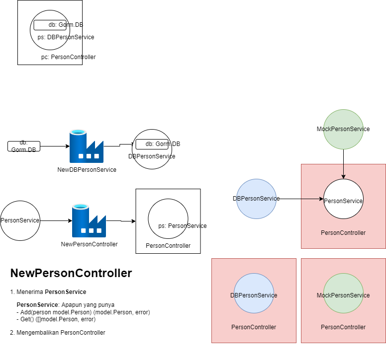

# Run with Docker Compose

```bash
# start + create
docker-compose up -d

# start
docker-compose start

# stop
docker-compose stop

# remove
docker-compose down

# build images
docker-compose build

# push images
docker-compose push
```