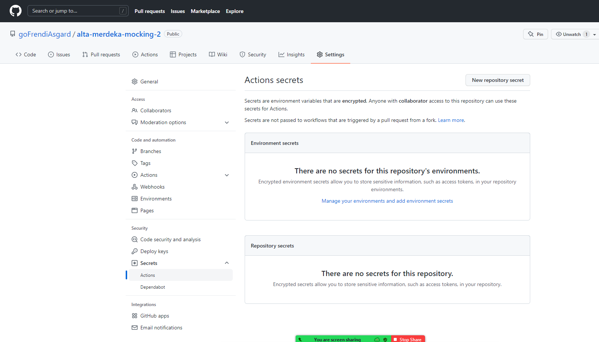

# Run with Docker Compose

```bash
# start + create
docker-compose up -d

# start
docker-compose start

# stop
docker-compose stop

# remove
docker-compose down

# build images
docker-compose build

# push images
docker-compose push
```

# Install docker on ec2

[source](https://thomasventurini.com/articles/install-docker-and-compose-in-ubuntu/)

```bash
sudo chmod 700 <key.pem>
ssh -i <key.pem> ubuntu@public-ip

sudo apt-get update \
&& sudo apt-get install \
    apt-transport-https \
    ca-certificates \
    curl \
    gnupg-agent \
    software-properties-common \
&& curl -fsSL https://download.docker.com/linux/ubuntu/gpg | sudo apt-key add - \
&& sudo add-apt-repository \
   "deb [arch=amd64] https://download.docker.com/linux/ubuntu \
   $(lsb_release -cs) \
   stable" \
&& sudo apt-get update \
&& sudo apt-get install docker-ce docker-ce-cli containerd.io

sudo groupadd docker \
&& sudo usermod -aG docker $USER \
&& newgrp docker # this enables the group without the need of a restart

sudo curl -L "https://github.com/docker/compose/releases/latest/download/docker-compose-$(uname -s)-$(uname -m)" -o /usr/local/bin/docker-compose \
&& sudo chmod +x /usr/local/bin/docker-compose
```

Quick hack:

```
sudo chmod 777 /var/run/docker.sock
```

# Copy to ec2

```bash
cd ..
# sesuaikan keypair nya (i.e: laptop.pem)
rsync -r -e "ssh -i ~/laptop.pem" merdekaMock2 ubuntu@54.179.163.193:/home/ubuntu
```

# Run docker compose on server

```bash
docker-compose up -d
```

# Set up Github action

* Buat EC2 instance

* Set security group's inbound rule untuk open port 8080 (atau sesuai definisi di docker-compose)

* Masuk ke EC2

* Install docker + docker-compose (lihat section sebelumnya)

* Buat SSH key: `ssh-keygen && cat ~/.ssh/id_rsa.pub`

* Connect kan ssh key di EC2 ke github

  

* Lakukan git clone

```bash
cd ~
git clone git@github.com:goFrendiAsgard/alta-merdeka-mocking-2.git
cd alta-merdeka-mocking-2
git pull origin master
```

* Create secret




